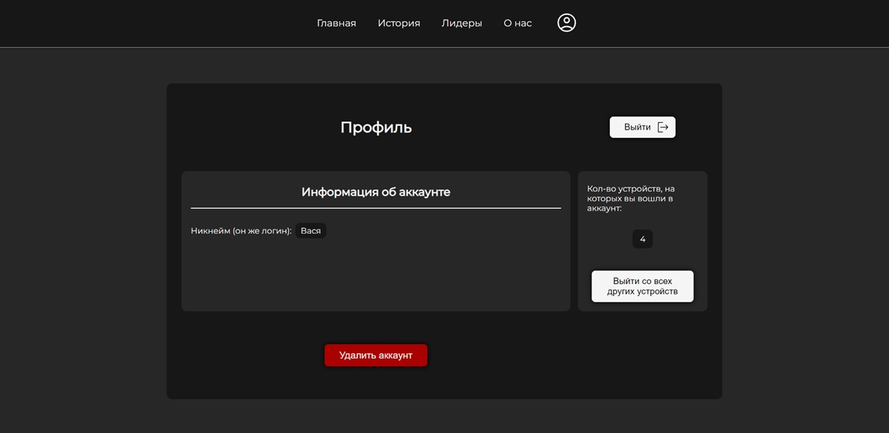
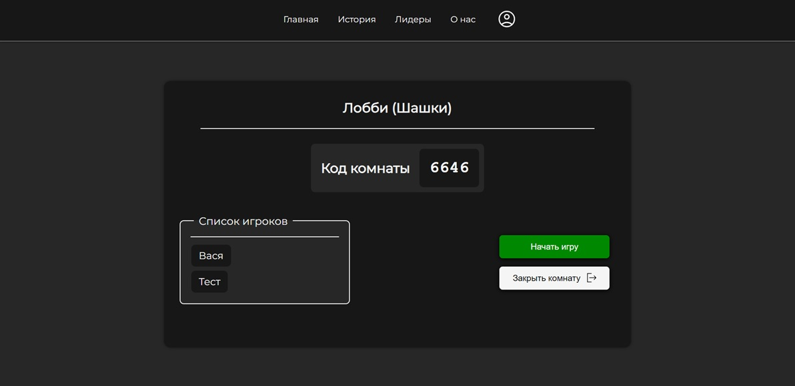
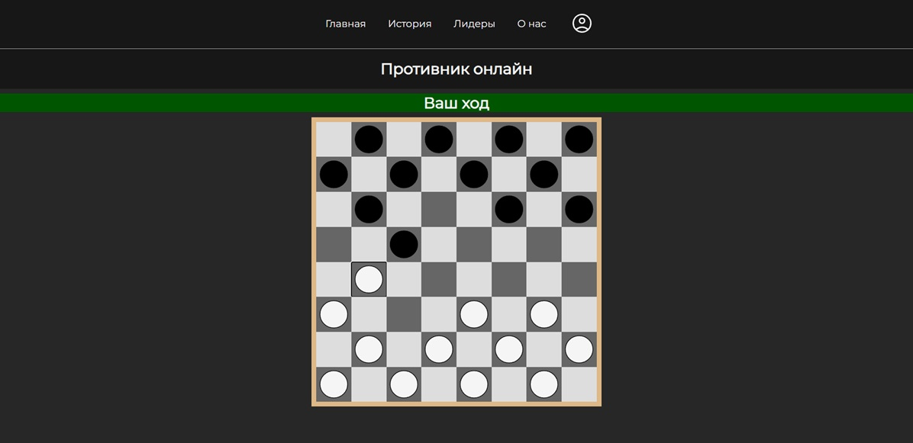

# WebBoardGames (WIP)

Всё ещё в разработке, многое может поменяться...
***

Веб-приложение для онлайн настольных игры, написанное на ASP.NET + React.

- JWT-токены для аутентификации
- SignalR для связи сервера и клиента в реальном времени (во время игры и в лобби)

# Запуск
Windows:
- Запусти ``run_server.bat``
- Запусти ``run_client.bat``

Linux:
- Запусти ``run_server.sh``
- Запусти ``run_client.sh``

# Внешний вид
### Главная страница

### Профиль

### Лобби

### Шашки

