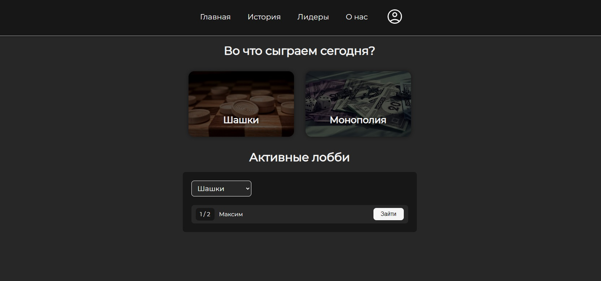
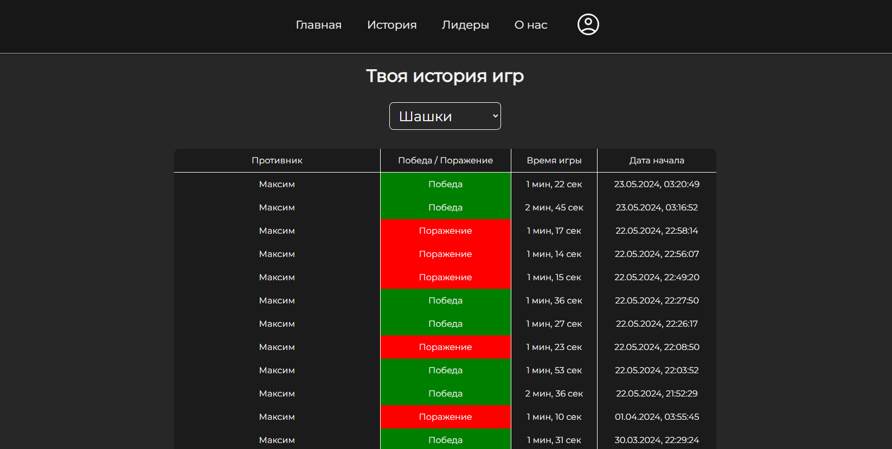
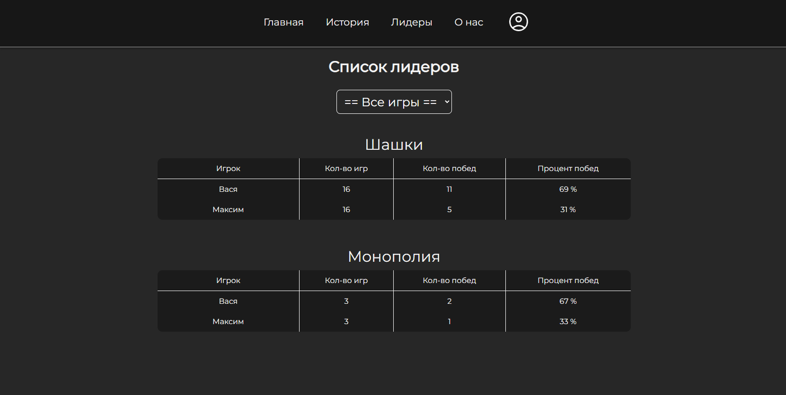
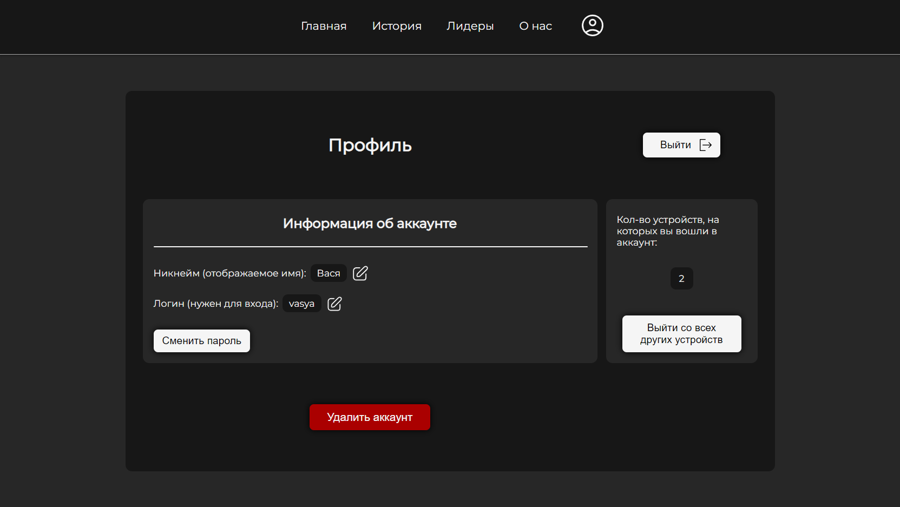
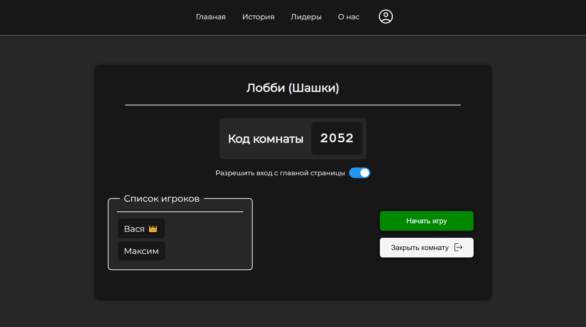
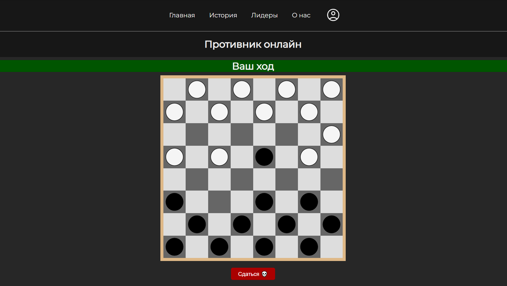
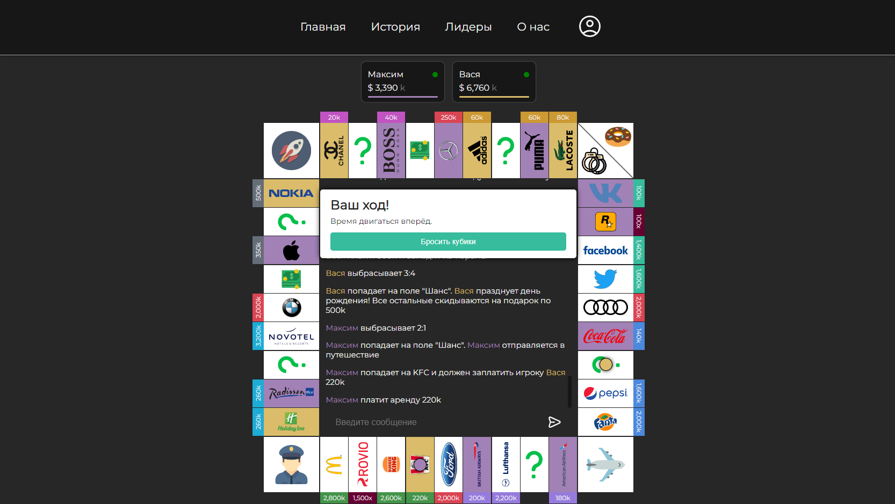

# WebBoardGames
Эта дипломная работа - бесплатная онлайн-платформа для виртуальных настольных игры, написанная на ASP.NET + React.

- Минималистичный современный дизайн
- Своя реализация авторизации на JWT-токенах
- SignalR для связи сервера и клиента в реальном времени
- Потокобезопасная обертка для облегчения создания игр

# Как помочь разработке
Нашел какую-то проблему, баг или недоработку, пиши в issues.

Хочешь сам поправить какой-то баг или улучшить существующий код?
Создавай свою ветку и делай pull-request со своими изменениями.

Хочешь создать новую игру? Инструкция [в этом разделе](#как-создать-новую-игру).

# Как запустить локально
Создай базу данных PostgreSQL по схеме `webapi/webapi/Data/Schemas/WebBoardGamesDB.sql`

Добавь в файл `webapi/webapi/appsettings.Development.json` строку подключения к БД и случайный jwt ключ длиной 128 символов (вместо `stub`):
```json
  "ConnectionStrings": {
    "DefaultConnection": "stub"
  },
  "Jwt": {
    "Issuer": "http://localhost:5042",
    "Audience": "http://localhost:3000",
    "Key": "stub"
  },
```

Windows:
- Запусти ``run_server.bat``
- Запусти ``run_client.bat``

Linux:
- Запусти ``run_server.sh``
- Запусти ``run_client.sh``

# Как создать новую игру
1. Посмотри, нет ли ее в списке `games.txt`.
2. Если ее там нет, сделай pull request с добавлением игры в этот список.
3. Начинай разработку в своей ветке (в названии ветки нужно указать название игры).
4. В webapi в папке `Games` создай папку с названием игры и класс игры с названием типа `CheckersGame`, где `Checkers` - название игры. Наследуйся от абстрактного класа `PlayableGame`.
5. В webapi зарегистрируй игру в файлах `GameServicesConfigurator.cs`, `GameEndpoints.cs` и `GameNameToLobbyServiceMapper.cs` по аналогии с другими играми.
6. В reactapp в папке `Games` создай папку с названием игры и файл-компонент игры с названием типа `checkersGame.tsx`, где `checkers` - название игры.
7. В reactapp в папке `Games/Lobby` создай файл с лобби своей игры по аналогии с лобби других игр.
8. В reactapp зарегистрируй игру и лобби в файле `App.tsx` по аналогии с другими играми.

Перед принятием важных решений обязательно вешай ревью на [CompleXss](https://github.com/CompleXss).

# Внешний вид
### Главная страница


### История игр


### Список лидеров


### Профиль


### Лобби


### Шашки


### Монополия

